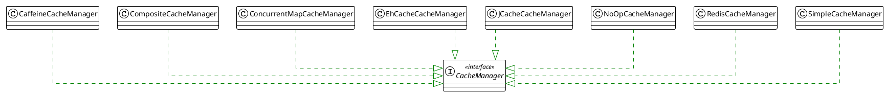
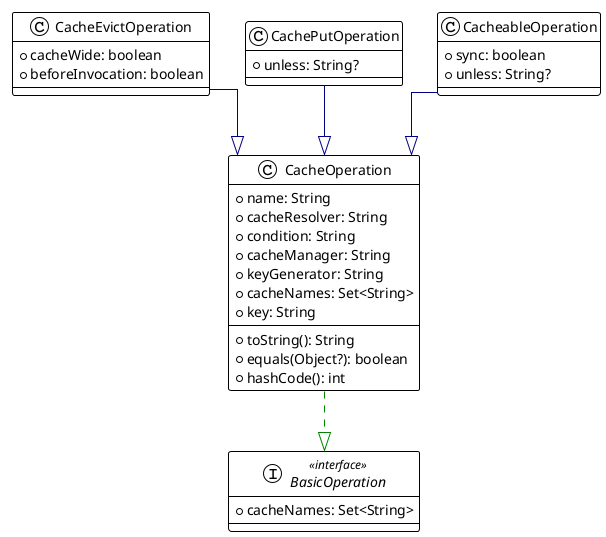

# cache

缓存抽象的核心是对Java方法进行缓存，从而根据缓存中的信息减少执行的次数。

每当一个目标方法被调用时，该抽象都会应用一个缓存行为，检查该方法是否已经被给定的参数所调用。如果它已经被调用，缓存的结果将被返回，而不需要调用实际的方法。如果该方法没有被调用，那么它就被调用，结果被缓存并返回给用户，这样，在下次调用该方法时，缓存的结果就会被返回。

这样一来，昂贵的方法（无论是CPU还是IO）对于一组给定的参数可以只被调用一次，并且结果可以重复使用，而不需要再次实际调用该方法。缓存逻辑是透明地应用的，对调用者没有任何干扰。

spring提供了cache服务，这个抽象使你不必编写缓存逻辑，需要使用实际的存储来存储缓存数据。下面介绍具体的使用。

```xml
<dependency>
  <groupId>org.springframework.boot</groupId>
  <artifactId>spring-boot-starter-cache</artifactId>
</dependency>
```

## 基于声明性注释的缓存

- `@Cacheable`：触发缓存入口。

- `@CacheEvict`：触发缓存驱逐。

- `@CachePut`：更新缓存而不干扰方法的执行。

- `@Caching`: 将多个缓存操作重新分组，应用于一个方法。

- `@CacheConfig`：在类的层面上分享一些常见的缓存相关设置。

### The @Cacheable Annotation

```java
@Cacheable("books")
public Book findBook(ISBN isbn) {...}
```

findBook方法与名为books的缓存相关。每次调用该方法时，都会检查缓存，看是否已经运行过该调用，而不必重复。虽然在大多数情况下，只有一个缓存被声明，但注解允许指定多个名字，这样就可以使用多个缓存了。在这种情况下，每个缓存在调用方法之前都会被检查--如果至少有一个缓存被命中，相关的值会被返回。

```java
@Cacheable({"books", "isbns"})
public Book findBook(ISBN isbn) {...}
```

#### 默认键生成器

由于缓存本质上是键值存储，每一次对缓存方法的调用都需要转化为一个合适的键，以便缓存访问。```SimpleKeyGenerator``` 默认键生成器

- 无参数方法，返回SimpleKey.EMPTY
- 一个参数，返回参数本身
- 多个参数，返回SimpleKey

参数注意实现hashCode()和equals()方法，可以自定义生成器 实现 `org.springframework.cache.interceptor.KeyGenerator` 接口.`

```java
public class SimpleKeyGenerator implements KeyGenerator {

  @Override
  public Object generate(Object target, Method method, Object... params) {
    return generateKey(params);
  }

  /**
   * Generate a key based on the specified parameters.
   */
  public static Object generateKey(Object... params) {
    if (params.length == 0) {
      return SimpleKey.EMPTY;
    }
    if (params.length == 1) {
      Object param = params[0];
      if (param != null && !param.getClass().isArray()) {
        return param;
      }
    }
    return new SimpleKey(params);
  }
}
```

#### 自定义键生成器

```java
@Cacheable(cacheNames="books", keyGenerator="myKeyGenerator")
public Book findBook(ISBN isbn, boolean checkWarehouse, boolean includeUsed){...}
```

#### 指定key 支持SpEL 和 keyGenerator 互斥

```java
@Cacheable(cacheNames="books", key="#isbn.id")
public Book findBook(ISBN isbn, boolean checkWarehouse, boolean includeUsed){...}
```

#### 同步缓存

使用`sync`属性

```java
@Cacheable(cacheNames="foos", sync=true) 
public Foo executeExpensiveOperation(String id) {...}
```

#### 条件缓存

有时，一个方法可能不适合一直被缓存（例如，它可能取决于给定的参数）。缓存注解通过条件参数支持这样的用例，条件参数接受一个SpEL表达式，该表达式被评估为真或假。如果为真，该方法被缓存。如果不是，它的行为就像该方法没有被缓存一样（也就是说，无论缓存中的值是什么或者使用了什么参数，该方法每次都被调用）

```java
@Cacheable(cacheNames="book", condition="#name.length() < 32") 
public Book findBook(String name)
```

除了`condition`参数外，你还可以使用`unless`参数来否决向缓存中添加值。与`condition`不同的是，除非表达式是在方法被调用后进行评估的。为了扩展前面的例子，也许我们只想缓存平装书，就像下面的例子那样：

```java
@Cacheable(cacheNames="book", condition="#name.length() < 32", unless="#result?.hardback")
public Optional<Book> findBook(String name)
```

#### 自定义缓存处理器

默认的缓存分辨率很适合那些使用单个CacheManager并且没有复杂缓存分辨率要求的应用。

对于与多个缓存管理器一起工作的应用程序，你可以设置每个操作使用的缓存管理器，如下例所示：

```java
@Cacheable(cacheNames="books", cacheManager="anotherCacheManager") (1)
public Book findBook(ISBN isbn) {...}
```

你也可以用类似于替换密钥生成的方式来完全替换CacheResolver。每一个缓存操作都会请求解析，让实现根据运行时的参数实际解析要使用的缓存。下面的例子展示了如何指定一个CacheResolver：

```java
@Cacheable(cacheResolver="runtimeCacheResolver") (1)
public Book findBook(ISBN isbn) {...}
```

### The @CachePut Annotation

当需要更新缓存而不干扰方法的执行时，你可以使用@CachePut注解。也就是说，该方法总是被调用，其结果被放入缓存（根据@CachePut选项）。它支持与@Cacheable相同的选项。下面的例子使用了@CachePut注解：

```java
@CachePut(cacheNames="book", key="#isbn")
public Book updateBook(ISBN isbn, BookDescriptor descriptor)
```

### The @CacheEvict annotation

缓存抽象不仅允许缓存存储的数量，而且还允许驱逐。@CacheEvict需要指定一个或多个受行动影响的缓存，允许指定一个自定义的缓存和密钥解析或条件，并具有一个额外的参数（allEntries），使用`allEntries`属性来驱逐缓存中的所有条目。你也可以通过使用`beforeInvocation`属性来说明驱逐是在方法被调用之后（默认）还是之前发生。前者提供了与其他注释相同的语义

```java
@CacheEvict(cacheNames = "books", allEntries = true, beforeInvocation = true)
public void loadBooks(InputStream batch)
```

### The @Caching Annotation

有时，同一类型的多个注解（如@CacheEvict或@CachePut）需要被指定--例如，因为不同缓存的条件或关键表达式是不同的。@Caching允许在同一个方法上使用多个嵌套的@Cacheable、@CachePut和@CacheEvict注释。下面的例子使用了两个@CacheEvict注解：

```java
@Caching(evict = { @CacheEvict("primary"), @CacheEvict(cacheNames="secondary", key="#p0") })
public Book importBooks(String deposit, Date date)
```

### The @CacheConfig annotation

到目前为止，我们已经看到缓存操作提供了许多自定义选项，而且你可以为每个操作设置这些选项。然而，如果一些自定义选项适用于类的所有操作，那么配置起来就会很繁琐。例如，为类的每个缓存操作指定使用的缓存名称，可以用一个类级的定义来代替。这就是@CacheConfig开始发挥作用的地方。下面的例子使用@CacheConfig来设置缓存的名称：

```java
@CacheConfig("books")
public class BookRepositoryImpl implements BookRepository {
    @Cacheable
    public Book findBook(ISBN isbn) {...}
}
```

支持以下属性的统一配置

- cacheNames
- keyGenerator
- cacheManager
- cacheResolver

### Enabling Caching Annotations

声明缓存注解并不能自动触发它们的动作，需要启用缓存，注解方式

```java
@Configuration
@EnableCaching
public class AppConfig {
}
```

xml方式

```xml
<beans xmlns="http://www.springframework.org/schema/beans"
    xmlns:xsi="http://www.w3.org/2001/XMLSchema-instance"
    xmlns:cache="http://www.springframework.org/schema/cache"
    xsi:schemaLocation="
        http://www.springframework.org/schema/beans https://www.springframework.org/schema/beans/spring-beans.xsd
        http://www.springframework.org/schema/cache https://www.springframework.org/schema/cache/spring-cache.xsd">

        <cache:annotation-driven/>
</beans>

```

## 基于XML的声明式缓存

如果没办法使用注解（也许是由于无法访问源代码或没有外部代码），你可以使用XML进行声明式缓存。因此，你可以在外部指定目标方法和缓存指令（类似于声明式事务管理建议），而不是为缓存注解方法。上一节的例子可以翻译成下面的例子：

```xml
<!-- the service we want to make cacheable -->
<bean id="bookService" class="x.y.service.DefaultBookService"/>

<!-- cache definitions -->
<cache:advice id="cacheAdvice" cache-manager="cacheManager">
    <cache:caching cache="books">
        <!-- cache method -->>
        <cache:cacheable method="findBook" key="#isbn"/>
        <cache:cache-evict method="loadBooks" all-entries="true"/>
    </cache:caching>
</cache:advice>

<!-- apply the cacheable behavior to all BookService interfaces -->
<aop:config>
    <aop:advisor advice-ref="cacheAdvice" pointcut="execution(* x.y.BookService.*(..))"/>
</aop:config>

<!-- cache manager definition omitted -->

```

## 配置缓存存储 cacheManager



### JDK ConcurrentMap-based Cache

前面的片段使用SimpleCacheManager为两个嵌套的ConcurrentMapCache实例创建一个CacheManager，命名为default和books。注意，这些名字是为每个缓存直接配置的。

由于缓存是由应用程序创建的，它被绑定在其生命周期中，使其适用于基本用例、测试或简单的应用程序。缓存的扩展性很好，速度也非常快，但它不提供任何管理、持久化能力或驱逐合同。

```xml
<!-- simple cache manager -->
<bean id="cacheManager" class="org.springframework.cache.support.SimpleCacheManager">
    <property name="caches">
        <set>
            <bean class="org.springframework.cache.concurrent.ConcurrentMapCacheFactoryBean" p:name="default"/>
            <bean class="org.springframework.cache.concurrent.ConcurrentMapCacheFactoryBean" p:name="books"/>
        </set>
    </property>
</bean>
```

### Caffeine Cache

Caffeine是一个基于Java 8的高性能缓存库，提供了丰富的属性设置来控制缓存的行为。以下是Caffeine中常用的属性设置：

- maximumSize(long maximumSize)：设置缓存的最大容量，超过容量时会自动回收缓存项。

- expireAfterAccess(Duration duration)：设置缓存项在最后一次访问之后的过期时间，过期后会自动回收缓存项。

- expireAfterWrite(Duration duration)：设置缓存项在创建或最后一次更新之后的过期时间，过期后会自动回收缓存项。

- refreshAfterWrite(Duration duration)：设置缓存项在创建或最后一次更新之后的刷新时间，刷新后会自动重新加载缓存项。

- weakKeys()：启用弱引用存储缓存键，当缓存键不再被其他对象引用时，会自动回收缓存项。

- weakValues()：启用弱引用存储缓存值，当缓存值不再被其他对象引用时，会自动回收缓存项。

- softValues()：启用软引用存储缓存值，当系统内存不足时，会自动回收缓存值。

- recordStats()：启用缓存统计信息，可以通过Cache.stats()方法获取缓存统计信息。

- executor(Executor executor)：设置缓存异步加载的线程池。

- removalListener(RemovalListener listener)：设置缓存项被回收时的监听器。

以上是Caffeine中常用的属性设置，您可以根据具体需求选择适合的属性设置来控制缓存的行为。

```xml
<dependency>
  <groupId>com.github.ben-manes.caffeine</groupId>
  <artifactId>caffeine</artifactId>
</dependency>
```

```xml
<bean id="cacheManager"
        class="org.springframework.cache.caffeine.CaffeineCacheManager"/>
```

```java
@Bean("caffeineCacheManager")
public CacheManager cacheManager() {
  return new CaffeineCacheManager();
}


@Bean("caffeineCacheManager")
public CacheManager cacheManager() {
    CaffeineCacheManager cacheManager = new CaffeineCacheManager();

    cacheManager.setCaffeine(Caffeine.newBuilder()
            // 设置写入过期时间
            .expireAfterWrite(Duration.ofMinutes(5))
            // 初始的缓存空间大小
            .initialCapacity(100)
            // 缓存的最大条数
            .maximumSize(1000));
    return cacheManager;
}
```


### Redis Cache

```xml
<dependency>
  <groupId>org.springframework.boot</groupId>
  <artifactId>spring-boot-starter-data-redis</artifactId>
</dependency>
```

```java
@Bean("redisCacheManager")
public CacheManager redisCacheManager(@Autowired RedisTemplate<Object, Object> template) {

    RedisConnectionFactory connectionFactory = template.getConnectionFactory();

    if (connectionFactory == null) {
        throw new IllegalStateException("RedisConnectionFactory is required");
    }

    return RedisCacheManager.RedisCacheManagerBuilder
            // Redis 连接工厂
            .fromConnectionFactory(template.getConnectionFactory())
            // 缓存配置
            .cacheDefaults(getCacheConfigurationWithTtl(60 * 60))
            // 不同的缓存 设置不同的过期时间
            .withCacheConfiguration("cache_user", getCacheConfigurationWithTtl(60))
            // 配置同步修改或删除 put/evict
            .transactionAware()
            .build();
}
RedisCacheConfiguration getCacheConfigurationWithTtl(long seconds) {

    return RedisCacheConfiguration
            .defaultCacheConfig()
            // 设置key为String
            .serializeKeysWith(RedisSerializationContext.SerializationPair.fromSerializer(StringRedisSerializer.UTF_8))
            // 设置value 为自动转Json的Object
            .serializeValuesWith(RedisSerializationContext.SerializationPair.fromSerializer(new GenericJackson2JsonRedisSerializer()))
            // 缓存数据保存1小时
            .entryTtl(Duration.ofSeconds(seconds));
}
```



